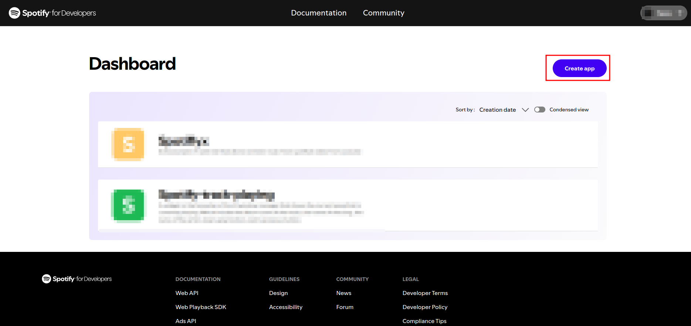
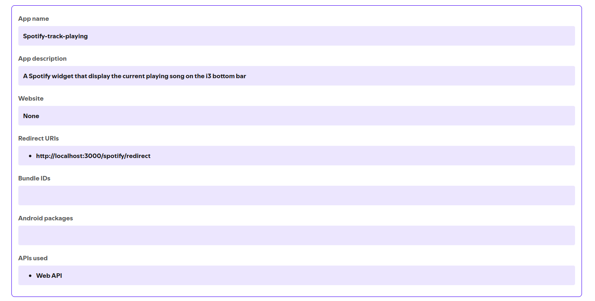

# i3 Spotify Widget
This project allow you to see the current song playing by Spotify on the i3 tiling window manager.
The song & the artist with additional emoji are display on the bottom bar. Along side with the system information like the battery percentage, the CPU usage, ...
> 💡 As we are using i3, everything can be shape to your need & desire. I suggest you to look at the [i3bar documentation](https://i3wm.org/docs/userguide.html#_configuring_i3bar) if you want to do for the i3 bar.

---

## How to use it?
### 1. **Setup your Spotify API key**
- Go to the [Spotify Dashboard](https://developer.spotify.com/dashboard) 
- Connect to your Spotify Account or create a new one
- Click on **Create app** (see the image below)

- Fill the field (see mine below)


### 2. **Setup the script**
In the command line (wherever you desire) execute
-  ``` git clone git@github.com:yanisdolivet/i3_Spotify_Widget.git ```
- ``` mv spotify-track-playing ~/.config/i3/scripts/ ```
- ``` nano ~/.config/i3/i3blocks.conf ``` --> *you can use whatever code editor you want*
- add the following code:
```
separator=fasle 
markup=pango

[Spotify]
command=~/.config/i3/scripts/spotify-track-playing
interval=2
color=#3AE075

```
 below this line  - ``` #The top properties below are applied to every block, but can be overridden```
- You can reload your i3 session or restart your computer to apply these changes

### 3. **Generate a valid token**

- Go to this url :
``` https://accounts.spotify.com/authorize?client_id=YOUR_CLIENT_ID&response_type=code&redirect_uri=YOUR_REDIRECT_URL&scope=user-read-playback-state ```
Replace *YOUR_CLIENT_ID* by your spotify client id [^1]
- It redirect you to a new url something like:
``` YOUR_REDIRECT_URL?code=SOME_CHARACTERS```
- Copy the long string of characters after the *code=* in the url
- Open in a code editor the refresh_token.py file situated in the repo you just clone
- Replace:
```client_id ``` : By your spotify client id (same as YOUR_CLIENT_ID in the url above)
``` client_secret``` : By your spotify secret
``` auth_code``` : By the code you copy above
``` redirect_uri``` : By your spotify redirect url
- In the command line run ```python refresh_token.py```
- Copy the access token print as output
- execute: ``` nano ~/.config/i3/scripts/spotify-track-playing```
- In the line:
```SPOTIFY_TOKEN_ID="YOUR_ACCESS_TOKEN"```
Replace ```YOUR_ACCESS_TOKEN``` by the access token you just copy
- Save & Enjoy the widget

---

# Hint

 > 💡 Since the access token has a timespan of 1 hour after it gets invalid you have to repeat the third step every hour if you want to keep getting a functional widget.

For a pretty obvious UX reason I'm currently trying to find a way to automate the process. An update will be deployed as soon as a solution will be find. Since then you have to keep doing the third step every hour sorry :/


[^1]:  You can find your client id, your secret id & your redirect URL by going to the [Spotify Dashboard](https://developer.spotify.com/dashboard) , choose the app you just created & in setting
